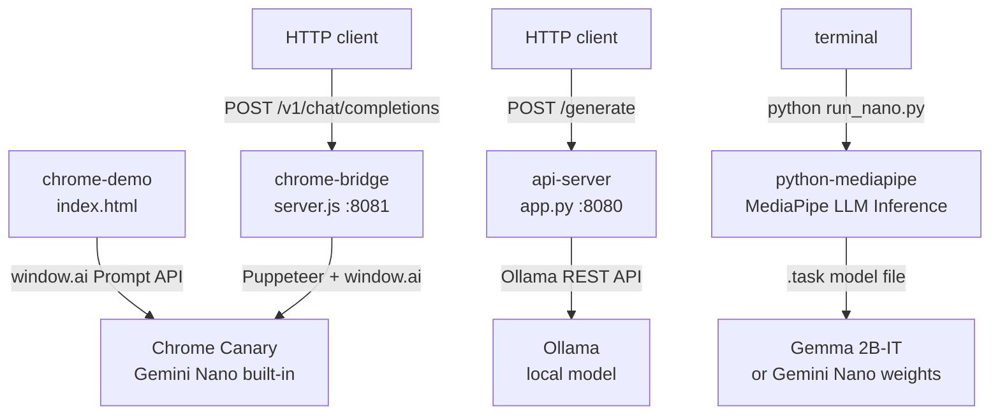

# gemini-nano

Experimental Gemini Nano on-device inference demos across browser, Python, and HTTP surfaces.

Public documentation is published from `docs/` via `mkdocs.yml` and
`.github/workflows/pages.yml`.

## Components

| Directory | Language | Port | Status |
|---|---|---|---|
| `api-server/` | Python (FastAPI + Ollama) | 8080 | Stable |
| `chrome-bridge/` | Node.js / Express | 8081 | Stable |
| `python-mediapipe/` | Python (MediaPipe) | — | Stable |
| `chrome-demo/` | HTML / JavaScript | — (file) | Stable |

## Architecture



## Quick Start

### api-server (Python + Ollama)

```bash
cd api-server
python -m venv .venv && .venv\Scripts\activate    # Windows
pip install -r requirements.txt
python app.py
# → http://localhost:8080
```

### chrome-bridge (Node.js)

```bash
cd chrome-bridge
npm install
npm start
# → http://localhost:8081
```

Test without Chrome:

```bash
npm test
```

### python-mediapipe

```bash
cd python-mediapipe
pip install -r requirements.txt
python run_nano.py "What is Gemini Nano?"
# Prints download instructions if model.task is absent (exits 0)
python run_nano.py --model-path /path/to/gemma2b-it.task "Your prompt"
```

### chrome-demo

Open `chrome-demo/index.html` directly in Chrome Canary with:

```
chrome://flags/#prompt-api-for-gemini-nano  →  Enabled
```

No server required.

## Setup

See [SETUP.md](SETUP.md) for Chrome flag configuration and model download instructions.
